

# **H-HOPE pilot sites**

The H-HOPE project aims to exploit hidden hydro energy from existing water infrastructures, such as sewage and irrigation channels, by using oscillating devices. These devices are designed to recover energy from flow-induced vibrations without significantly impacting the hydraulic operation.

To assess the potential power output of such energy harvesters, we analyzed velocity measurements from three candidate pilot sites:

**Site 1:** **Inlet channels of the Venice Lagoon** - Acoustic Doppler Current Profiler (ADCP) measurements were analyzed from three inlet channels in the Venice Lagoon. 

**Site 2:** **Verona sewage treatment plant discharge (Entrance of the Labyrinth)** - Located at the entrance of the labyrinth, in the plant’s final discharge channel.

We estimated the annual energy yield of a single cylindrical harvester (61 mm diameter × 1 m length) by applying a 1D-CFD–derived power curve to the site velocity time series and integrating instantaneous power over time.

## Site 1: Venice Lagoon inlet channels

In the Venice Lagoon there are three channels that connect the lagoon with the Adriatic Sea:

 - **Lido (San Nicolò) inlet (Location 1 and 2)** - the central/northern inlet running close to the Lido barrier island.

 - **Malamocco (Porto Corsini / Malamocco) inlet (Location 3)** - the middle inlet, south of Lido, used by large navigation channels.

 - **Chioggia (Sottomarina) inlet (Location 4)** - the southernmost inlet near Chioggia.

These inlets are shallow, tidally dominated gateways with strong flows during flood and ebb current. Depths vary but channels and navigation dredged areas can range from a few meters up to ~10–20 m in the deeper navigation cuts; large parts of the lagoon are much shallower.

The ADCPs Instruments in the Venice Lagoon sit on a seabed frame with the transducer facing upward to profile the whole water column continuously.

The velocity time series data for each of the four ADCPs were recorded at 5 minute intervals. Figure 2 show the measured surface level water velocity from all four ADCP sensors. Each dataset covers a two-month period during summer 2023. The selected locations in the Venice Lagoon inlet channels are marked with red dots in Figure 1.

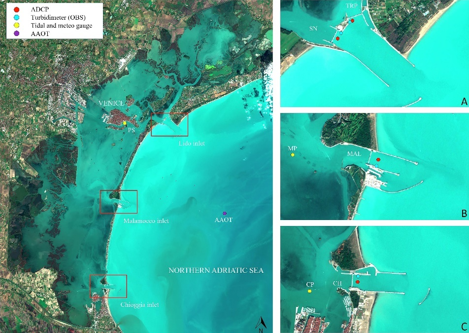

Figure 1: Marked locations (red dots) indicate where the ADCPs are installed in the inlet channels [Figure source](https://www.sciencedirect.com/science/article/pii/S002216942401984X).

**Water velocity data analysis**

The Figure 2 shows the time series of water velocity recorded over a two-month period in summer 2023 at all four of the Venice Lagoon inlet channels. The velocity patterns are strongly tidal, with clear, repeating cycles of acceleration and deceleration that correspond to ebb and flood tides. Peak velocities often reach or slightly exceed 1.0 m/s, whereas during slack tide they drop to almost zero. These results indicate a highly dynamic flow regime where strong bidirectional currents dominate water exchange between the lagoon and the Adriatic Sea.

The Figure 3 presents velocity duration curves (exceedance probability plot) for the same velocity data, illustrating the proportion of time different flow magnitudes are exceeded. High velocities above 1.0 m/s occur less than 5% of the time, indicating that extreme tidal currents are infrequent but hydrodynamically significant. The median velocity, around 0.45–0.5 m/s, reflects a persistently energetic environment where moderate currents prevail for much of the tidal cycle. The curve’s steep descent at low exceedance percentages shows that peak velocities diminish quickly in frequency, while the gentle slope toward 100% exceedance confirms the presence of extended slack periods.

| 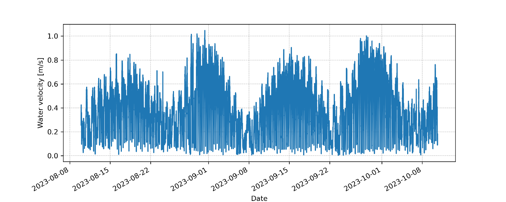 | 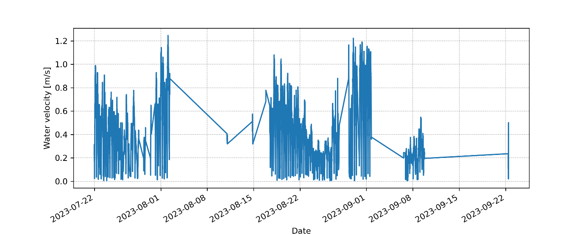 |
|----------------------------------|----------------------------------|
| 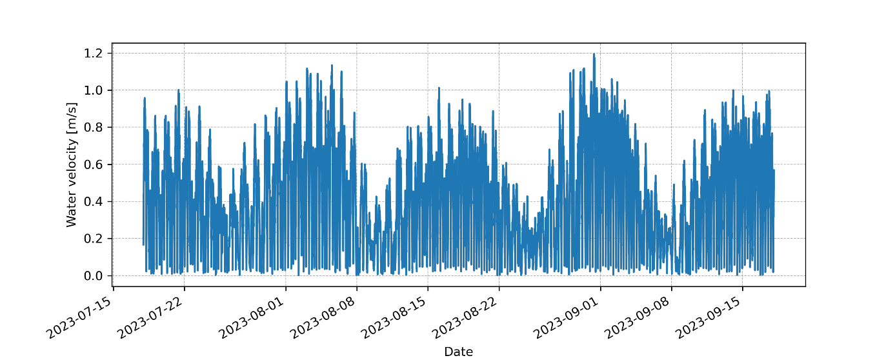 | 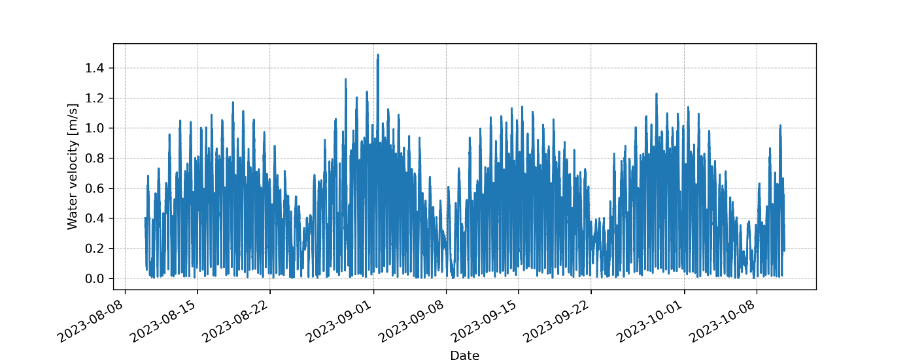 |

Figure 2: Water velocity for each ADCP in the proposed harvester installation locations in the Venice Lagoon inlet channels.

| 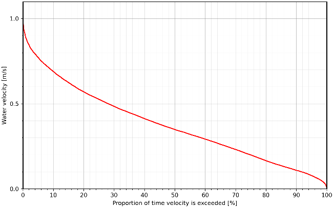 | 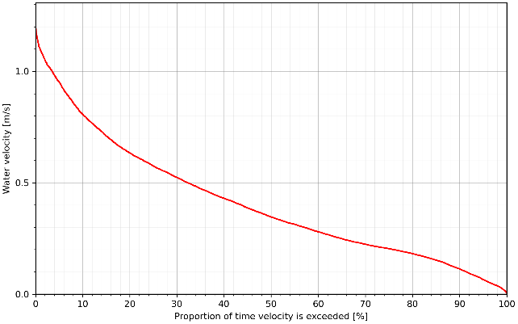 |
|----------------------------------|----------------------------------|
| 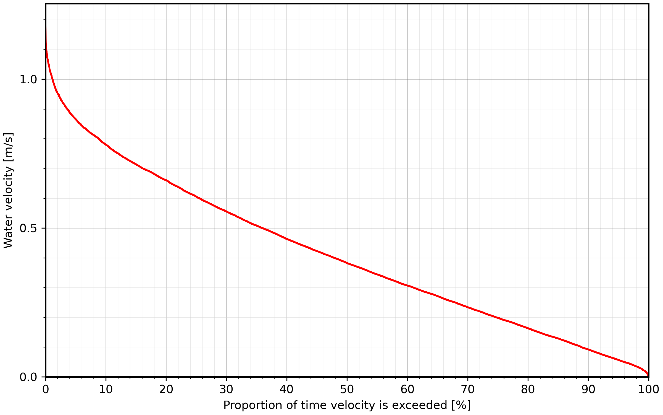 | 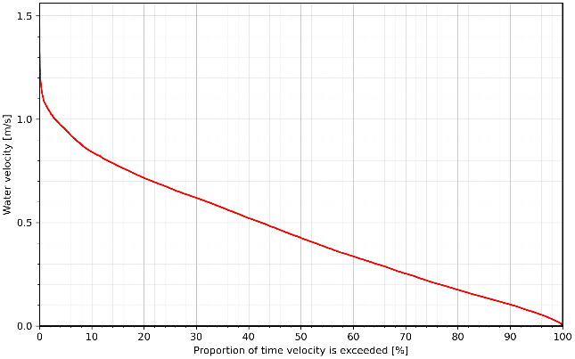 |

Figure 3: Velocity duration curves for each ADCP in the proposed harvester installation location in the Venice Lagoon inlet channels.

**H-HOPE Harvester Theoretical Energy Production Estimation**

The annual energy production estimated from the current analysis is 0.78 kWh yr⁻¹ (Location 1 — Lido1), 0.46 kWh yr⁻¹ (Location 2 — Lido2), 1.13 kWh yr⁻¹ (Location 3 — Malamocco) and 2.61 kWh yr⁻¹ (Location 4 — Chioggia). Energy production was calculated using a 1D CFD model developed by the University of Padova and water velocity measurements. The harvester cylinder diameter was set to 61 mm and the length of the cylinder was 1 m.

To manage the strong short-term variability in flow, the harvester should be paired with a modest battery and a smart power management unit: storing energy during high-discharge events and supplying it during low or no flow intervals. Practical battery sizing: with an estimated daily yield of 5 Wh/day, a 50 Wh pack provides 10 days autonomy , while a 150 Wh pack gives one month.

## Site 2: Verona sewage treatment discharge canal (Entrance of the Labyrinth)

We analyzed water velocity data collected from the Entrance of the outflow channel of the Verona sewage treatment plant, a location characterized by concentrated and laminar flow ideal for oscillating harvesters. Measurements, taken at one-minute intervals from January 2021 to December 2022, were analyzed to calculate potential harvester power generation.

**Water velocity data analysis**

The proposoed harvest intallation location, visible in Figure 4 offers concentrated, laminar flow ideal for the efficient operation of oscillating harvesters.
The velocity time series for 2021 and 2022 (Fig. 5) represents the measured water velocity at the selected location in the Verona sewage treatment discharge canal. The dataset spans from January 2021 to December 2022, with one minute sampling interval.

  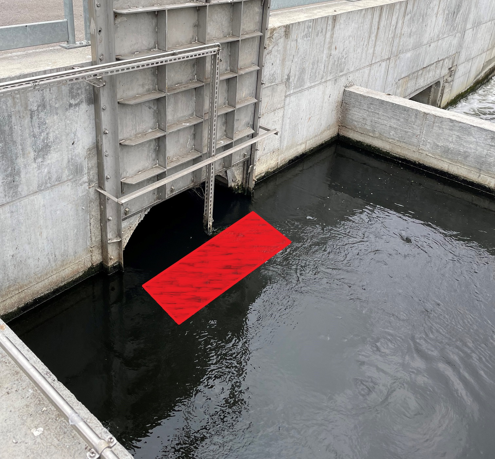

Figure 4: Proposed harvester installation location in the outflow of the Verona sewage treatment plant.

| 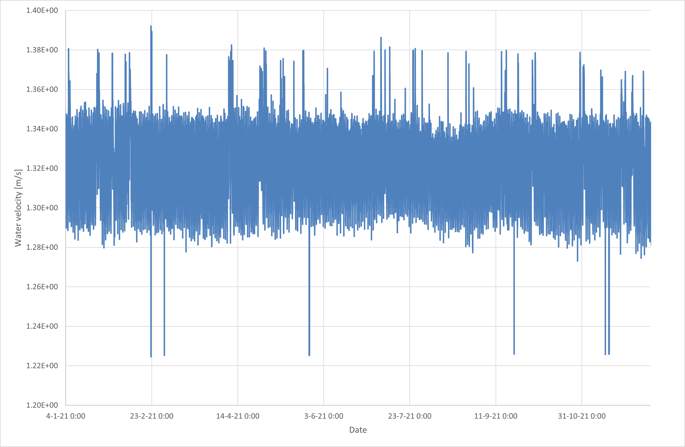 | 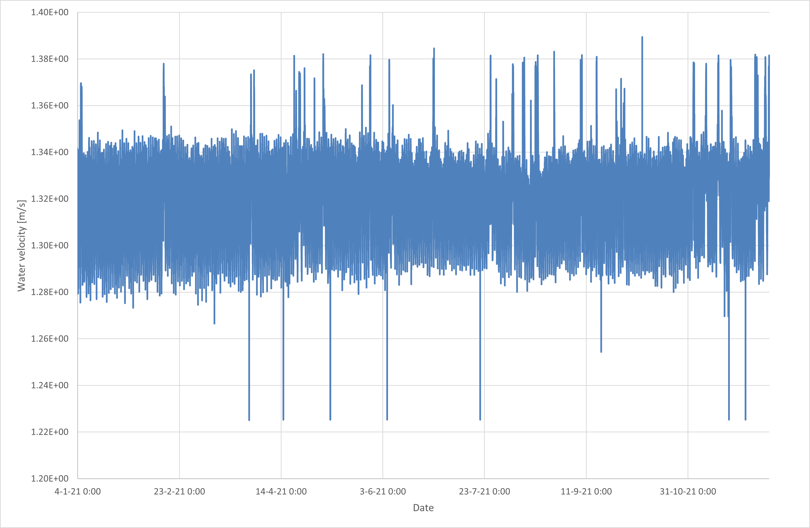 |
|----------------------------------|----------------------------------|

Figure 5: Water velocity in the proposed harvester installation location in the outflow of the Verona sewage treatment plant for the year 2021 left and 2022 right.

**Key observations**:

**Mean Flow Velocity**: The baseline water velocity hovers around **1.3–1.35 m/s**, with frequent short-term peaks reaching 1.36–1.38 m/s and occasional drops below 1.25 m/s. This indicates a relatively stable flow regime with intermittent deviations.

**Flow Variability**: The signal exhibits continuous small fluctuations, with sharp spikes and dips occurring irregularly. These variations are short in duration.

**Seasonal Trends**: No clear seasonal trends are visible across the year. The velocity distribution remains fairly consistent, with sporadic deviations scattered throughout the time series.

**H-HOPE Harvester Theoretical Energy Production Estimation**

Energy production was calculated using a 1D CFD model developed by the University of Padova. The harvester cylinder diameter was set to 61 mm and the length of the cylinder was 1 m. The energy output was calculated from average water speed data collected in 2021 and 2022, measured in one minute intervals.

Based on the cross section of the proposed installation site and the recorded flow data, we calculated the average one minute water speed in the proposed harvester installation section.

**For 2021, energy production was estimated at 79.45 kWh and for 2022, at 78.12 kWh.**

The Verona harvester is estimated to generate approximately 79 kWh per year (≈ 216 Wh per day), which is sufficient to reliably power a low power environmental monitoring node. With that energy it can support various sensors, for example, periodic measurements of water temperature, conductivity/pH, dissolved oxygen, turbidity, and a low-power ultrasonic flow meter plus a telemetry modem (LoRa/NB-IoT/4G) for intermittent data uplinks.

